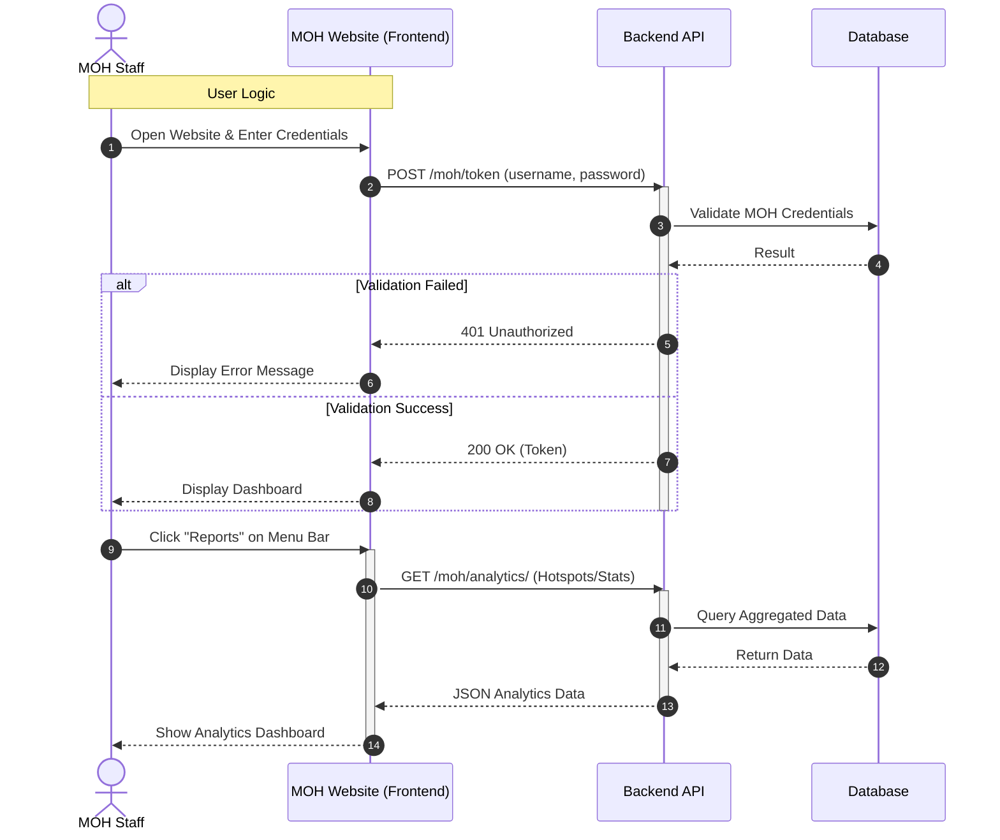
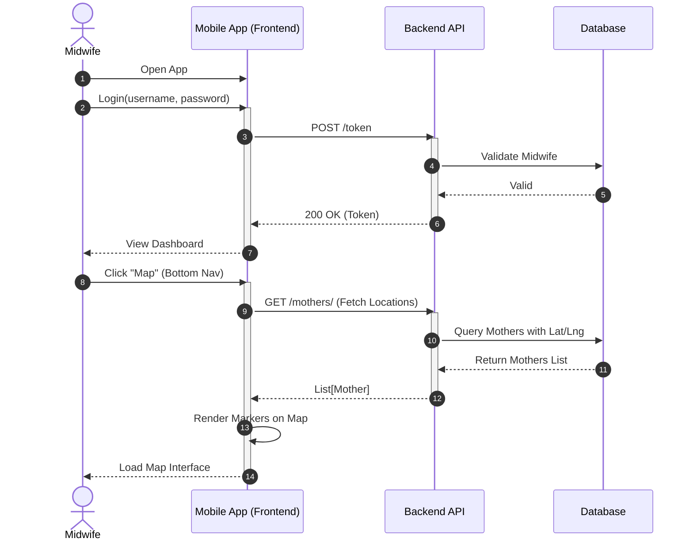
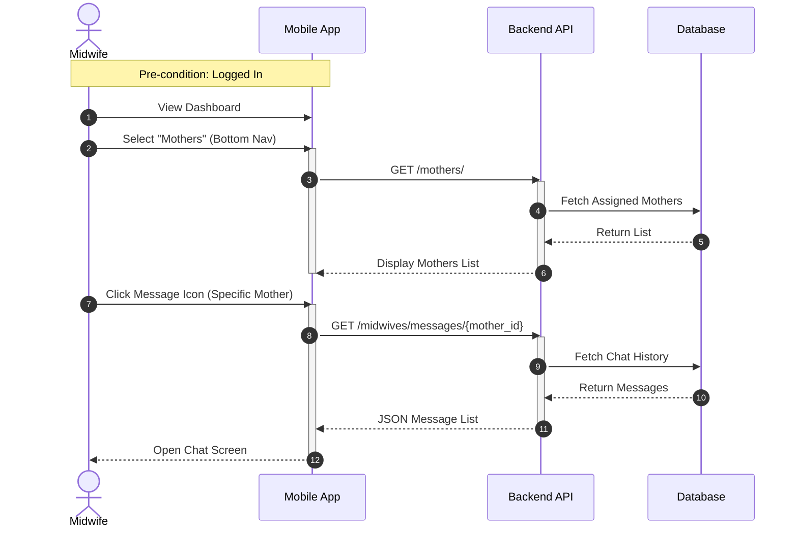
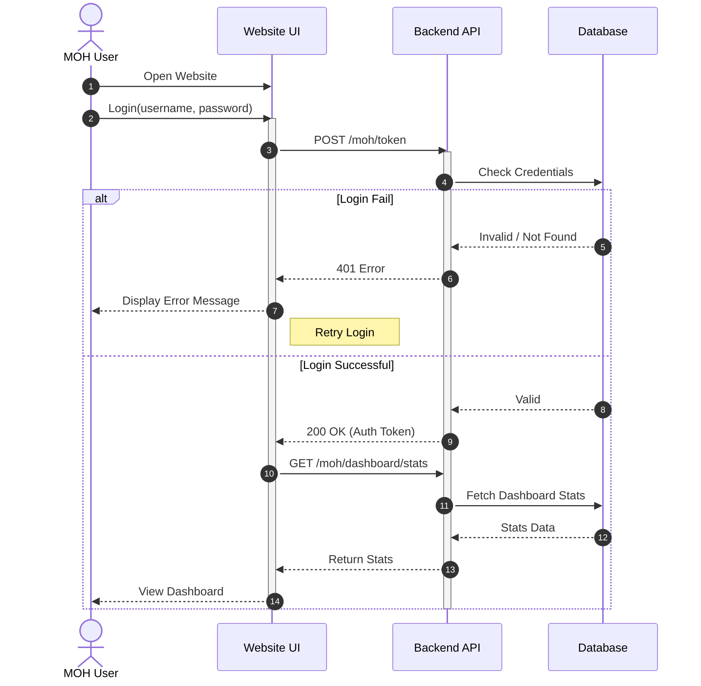

# Sequence Diagrams from Activity Flows

This document contains 4 sequence diagrams corresponding to the provided activity diagrams.

## 1. Overview Analytics for MOH (Website)

**Scenario**: MOH Staff logs in and views the Analytics Reports.

## 2. Location Map for Midwife (Mobile)

**Scenario**: Midwife logins and accesses the Map feature to view mother locations.

## 3. Communication / Texting (Mobile)

**Scenario**: Midwife selects a mother and opens the chat screen.

## 4. MOH Website Dashboard (Login)

**Scenario**: Standard Login flow for the MOH Website.

